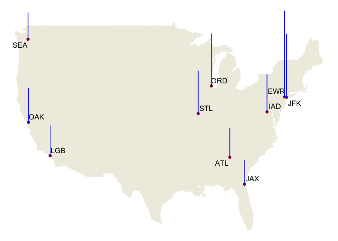

# Data visualization: flights at ABIA

## Worst Destination Airports

What are the bad airports to fly to if you want to depart from Austin?
We measure how “bad” these airports are with the proportion of delayed
or cancelled flights. Four levels of flights’ states are defined as:

-   On time: no delays
-   Minor delay: arrival delay \< 30 mins
-   Major delay: arrival delay > 30 min
-   Cancelled: flights being cancelled

Personally, we focus on flights being cancelled or with arrival delays
larger than 30 minutes, which are extremely annoying to travelers. The
“Bad Index” with which we rate destination airports are formally given
by

the sum of **\# of major delayed flights** and **\# of cancelled
flights** divided by the **\# from AUS to Destination**,

where \# refers to the number of flights.

The *yearly top 10 worst destination airports* of 2008 together with
their “Bad Index” are shown in Figure 1. **Newark airport** is the worst
airport given our rating system: the flights from Austin to Newark are
most likely to be delayed by over 30 minutes or cancelled. The second
follows **JFK airport** in New York. Considering that EWR also serves
The NYC Metropolitan Area, it seems that choosing **New York** as
destination is the real cause. Busy city and busy airports!

Figure 1: Top 10 Worst Destination of 2008

If you are also interested in if there are many minor delays in these
bad flights, Figure 2 shows the proportions of all kinds of flights’
states. If *minor delays can annoy you very much too*, then you must
avoid choosing **Atlanta airport** as your destination among the top 10
worst airports.

Figure 2: Distribution of Delays in Top 10 Worst Destination of 2008

Does the top list change over the months in 2008? Table 1 answers the
question in details by focusing on the top 5 worst airports in each
month. Definitely there are new blood across different months like
Boston airport in February, Ontario airport in April.

<table class="table" style="margin-left: auto; margin-right: auto;">
<caption>
Table 1: Top 5 Worst Destinations across Months
</caption>
<thead>
<tr>
<th style="text-align:right;">
Month
</th>
<th style="text-align:left;">
First
</th>
<th style="text-align:left;">
Second
</th>
<th style="text-align:left;">
Third
</th>
<th style="text-align:left;">
Fourth
</th>
<th style="text-align:left;">
Fifth
</th>
</tr>
</thead>
<tbody>
<tr>
<td style="text-align:right;">
1
</td>
<td style="text-align:left;">
ORD
</td>
<td style="text-align:left;">
CLE
</td>
<td style="text-align:left;">
SFO
</td>
<td style="text-align:left;">
EWR
</td>
<td style="text-align:left;">
JAX
</td>
</tr>
<tr>
<td style="text-align:right;">
2
</td>
<td style="text-align:left;">
BOS
</td>
<td style="text-align:left;">
ORD
</td>
<td style="text-align:left;">
JAX
</td>
<td style="text-align:left;">
EWR
</td>
<td style="text-align:left;">
STL
</td>
</tr>
<tr>
<td style="text-align:right;">
3
</td>
<td style="text-align:left;">
EWR
</td>
<td style="text-align:left;">
STL
</td>
<td style="text-align:left;">
JFK
</td>
<td style="text-align:left;">
ATL
</td>
<td style="text-align:left;">
CLE
</td>
</tr>
<tr>
<td style="text-align:right;">
4
</td>
<td style="text-align:left;">
ONT
</td>
<td style="text-align:left;">
SEA
</td>
<td style="text-align:left;">
EWR
</td>
<td style="text-align:left;">
DFW
</td>
<td style="text-align:left;">
JFK
</td>
</tr>
<tr>
<td style="text-align:right;">
5
</td>
<td style="text-align:left;">
EWR
</td>
<td style="text-align:left;">
MCI
</td>
<td style="text-align:left;">
SJC
</td>
<td style="text-align:left;">
OAK
</td>
<td style="text-align:left;">
DFW
</td>
</tr>
<tr>
<td style="text-align:right;">
6
</td>
<td style="text-align:left;">
EWR
</td>
<td style="text-align:left;">
JFK
</td>
<td style="text-align:left;">
OAK
</td>
<td style="text-align:left;">
IAD
</td>
<td style="text-align:left;">
ORD
</td>
</tr>
<tr>
<td style="text-align:right;">
7
</td>
<td style="text-align:left;">
JFK
</td>
<td style="text-align:left;">
OAK
</td>
<td style="text-align:left;">
EWR
</td>
<td style="text-align:left;">
ATL
</td>
<td style="text-align:left;">
IAD
</td>
</tr>
<tr>
<td style="text-align:right;">
8
</td>
<td style="text-align:left;">
JAX
</td>
<td style="text-align:left;">
JFK
</td>
<td style="text-align:left;">
EWR
</td>
<td style="text-align:left;">
LGB
</td>
<td style="text-align:left;">
OAK
</td>
</tr>
<tr>
<td style="text-align:right;">
9
</td>
<td style="text-align:left;">
HOU
</td>
<td style="text-align:left;">
JFK
</td>
<td style="text-align:left;">
ORD
</td>
<td style="text-align:left;">
EWR
</td>
<td style="text-align:left;">
LGB
</td>
</tr>
<tr>
<td style="text-align:right;">
10
</td>
<td style="text-align:left;">
TPA
</td>
<td style="text-align:left;">
EWR
</td>
<td style="text-align:left;">
HRL
</td>
<td style="text-align:left;">
IAD
</td>
<td style="text-align:left;">
ATL
</td>
</tr>
<tr>
<td style="text-align:right;">
11
</td>
<td style="text-align:left;">
CVG
</td>
<td style="text-align:left;">
TPA
</td>
<td style="text-align:left;">
EWR
</td>
<td style="text-align:left;">
MAF
</td>
<td style="text-align:left;">
ATL
</td>
</tr>
<tr>
<td style="text-align:right;">
12
</td>
<td style="text-align:left;">
LGB
</td>
<td style="text-align:left;">
EWR
</td>
<td style="text-align:left;">
MAF
</td>
<td style="text-align:left;">
ATL
</td>
<td style="text-align:left;">
IND
</td>
</tr>
</tbody>
</table>

A more sketchy way to capture the variability is counting how many time
airports occur in the monthly lists of top 5 worst. This is given by
Figure 3. There are 23 airports in all of the monthly lists, and this
also support our conclusion from yearly list: all 12 lists contains EWR
and 6 lists contains JFK.

Figure 3: Frequency of Appearances in Top 5 Worst Destinations across
Months

## Best Month to Depart from AUS

According to the following graph, it shows that September has the lowest
delay rate in 2008.

Delay Rate by Month in 2008

# Wrangling the Billboard Top 100

## Part A

<table class="table" style="margin-left: auto; margin-right: auto;">
<caption>
Table 2:Top 10 Most Popular Songs Since 1958
</caption>
<thead>
<tr>
<th style="text-align:left;">
Performer
</th>
<th style="text-align:left;">
Song
</th>
<th style="text-align:right;">
Count
</th>
</tr>
</thead>
<tbody>
<tr>
<td style="text-align:left;">
Imagine Dragons
</td>
<td style="text-align:left;">
Radioactive
</td>
<td style="text-align:right;">
87
</td>
</tr>
<tr>
<td style="text-align:left;">
AWOLNATION
</td>
<td style="text-align:left;">
Sail
</td>
<td style="text-align:right;">
79
</td>
</tr>
<tr>
<td style="text-align:left;">
Jason Mraz
</td>
<td style="text-align:left;">
I’m Yours
</td>
<td style="text-align:right;">
76
</td>
</tr>
<tr>
<td style="text-align:left;">
The Weeknd
</td>
<td style="text-align:left;">
Blinding Lights
</td>
<td style="text-align:right;">
76
</td>
</tr>
<tr>
<td style="text-align:left;">
LeAnn Rimes
</td>
<td style="text-align:left;">
How Do I Live
</td>
<td style="text-align:right;">
69
</td>
</tr>
<tr>
<td style="text-align:left;">
LMFAO Featuring Lauren Bennett & GoonRock
</td>
<td style="text-align:left;">
Party Rock Anthem
</td>
<td style="text-align:right;">
68
</td>
</tr>
<tr>
<td style="text-align:left;">
OneRepublic
</td>
<td style="text-align:left;">
Counting Stars
</td>
<td style="text-align:right;">
68
</td>
</tr>
<tr>
<td style="text-align:left;">
Adele
</td>
<td style="text-align:left;">
Rolling In The Deep
</td>
<td style="text-align:right;">
65
</td>
</tr>
<tr>
<td style="text-align:left;">
Jewel
</td>
<td style="text-align:left;">
Foolish Games/You Were Meant For Me
</td>
<td style="text-align:right;">
65
</td>
</tr>
<tr>
<td style="text-align:left;">
Carrie Underwood
</td>
<td style="text-align:left;">
Before He Cheats
</td>
<td style="text-align:right;">
64
</td>
</tr>
</tbody>
</table>

## Part B

Figure 4: Musical Diversity Over Time

## Part C

Figure 5: Artists Having over 30 Ten-Week-Hits Songs

# Wrangling the Olympics

## Part A

    ##   q95_height
    ## 1        183

The 95th percentile of heights for female competitors across all
Athletics events is **183cm**.

## Part B

<table class="table" style="width: auto !important; margin-left: auto; margin-right: auto;">
<thead>
<tr>
<th style="text-align:left;">
Event
</th>
<th style="text-align:right;">
Height Variability
</th>
</tr>
</thead>
<tbody>
<tr>
<td style="text-align:left;">
Rowing Women’s Coxed Fours
</td>
<td style="text-align:right;">
10.86549
</td>
</tr>
</tbody>
</table>

It is shown that women’s coxed four rowing had the greatest variability
in competitor’s heights across the entire history of the Olympics.

## Part C

Figure 6: Increasing Trend of Age Similar Across Female and Male
Swimmers’ Age After Female Participation in Olympics

# K-nearest neighbors

Figure 7: RMSE vs. K

Thus, the graphs show that the optimal K for predicting 350’s prices
with KNN method should be

    ## [1] 15

and the optimal K for predicting 65 AMG’s price with KNN method should
be

    ## [1] 12

given they yield the smallest RMSEs respectively.

Figure 8: Prediction vs. Testing Set

The trim of 350 tends to yield a larger optimal value of K. This might
be because the sample size of 350’s is larger and allows a bigger K to
capture more information, reduce estimation bias, and avoid being
heavily affected by noises.
